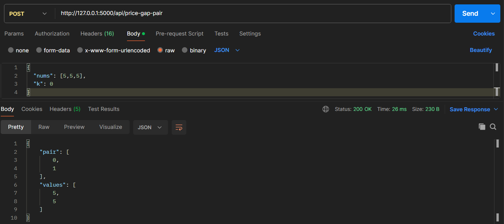
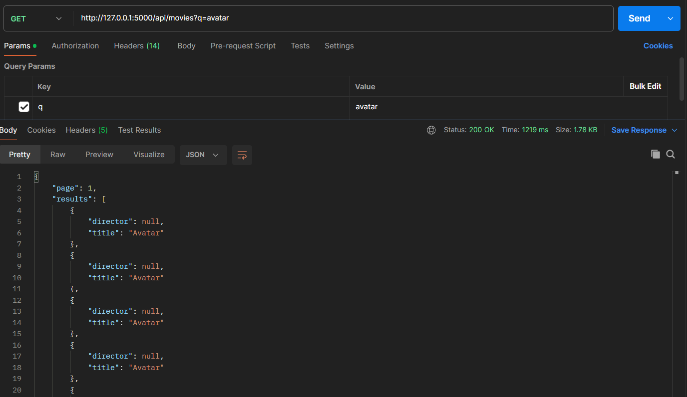
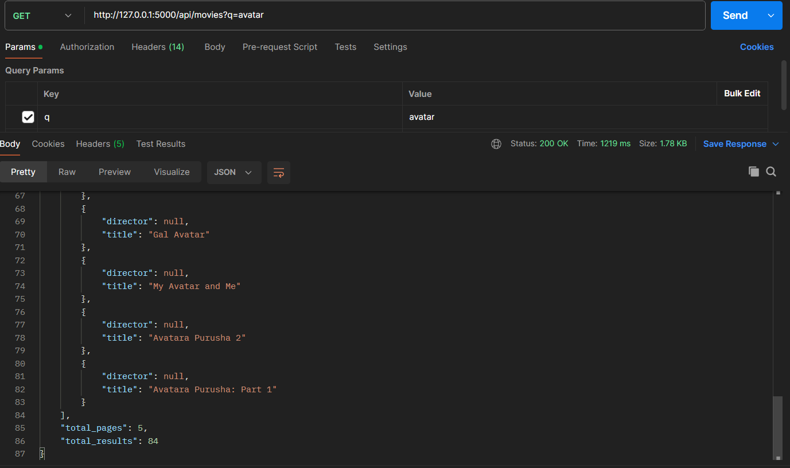

# API (Pair + Movies)

Small Python web api with two endpoints

## Setup

### 1. Clone / Download
- Clone or Download this repo

### 2. Install Dependencies
```bash
pip install -r requirements.txt
```

### 3. Configure Environment
Create .env file:
```
TMDB_BEARER=YOUR_TMDB_API_KEY_HERE
```
This is used only for the ```/api/movies``` endpoint.
you can create API key from [here](https://developer.themoviedb.org/docs/getting-started)

### 4. Run the script
- Run API
```bash
python main.py
```
- Server will start at:
```http://localhost:5000```

## Ouput
Endpoint: ```/api/price-gap-pair```



Endpoint: ```/api/price-gap-pair```



## References
Chat GPT: inplementation of a ```/api/price-gap-pair``` endpoint using its api