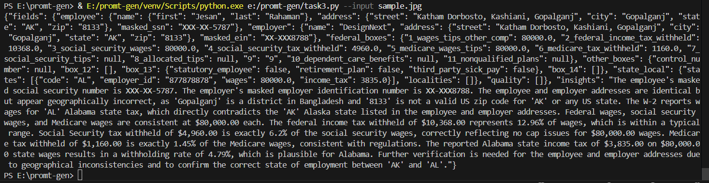

# W2 Extraction CLI (Gemini 2.5 Flash)

This Python script extracts structured fields + insights from a W2 document (image/pdf) using Gemini 2.5 Flash.

## Features
- Accepts JPG / JPEG / PNG / PDF
- Works with both local file paths & URLs
- Two stage extraction:
  1. Extract fields (json)
  2. Generate insights from those fields
- Test mode available which does not call the API


## Setup

### 1. Clone / Download
- Clone or Download this repo

### 2. Install Dependencies
```bash
pip install -r requirements.txt
```

### 3. Configure Environment
Create .env file:
```
GEMINI_API_KEY=YOUR_GEMINI_KEY_HERE
```
you can create API key from [here](https://ai.google.dev/gemini-api/docs/api-key)

### 4. How to Run
Image and PDF support (locally and URL)
```bash
python task3.py --input sample.pdf
```
```bash
python task3.py --input sample.jpeg
```
```bash
python task3.py --input https://example.com/w2_doc.png
```
Test mode does not calls the actual API and gives hardcoded output
```bash
python task3.py --input sample.pdf --test_mode
```

## Limitations
- **File Format Support**: Limited to PDF, JPEG, and PNG files only
- **API Dependency**: Requires active Gemini API key and internet connection
- **Error Handling**: No validation for W-2 forms or API failures
- **Single Document**: Processes one W-2 at a time, no batch processing
- **Response Format**: Assumes Gemini returns properly formatted text/JSON

## Outut:


## Refrences
API docs:
- https://ai.google.dev/gemini-api/docs/image-understanding
- https://ai.google.dev/gemini-api/docs/document-processing

Chat GPT (To implement CLI):

- Prompt:
```
i have a python program which processes some data and gives an dict as output, how can i implement A thin CLI or API wrapper (one command/endpoint) that returns the JSON result.
```
- Response: 
```
ok this is actually very very common pattern
this is how literally 90% research → productization starts

you have python code → gives python dict → you want thin wrapper → return JSON
NOT over engineer.

### OPTION 1 — CLI wrapper (one command)

use argparse and print json.dumps

```python
import argparse
import json
from your_logic import run_processing  # assume returns dict

def main():
    parser = argparse.ArgumentParser()
    parser.add_argument("--input", required=True)
    args = parser.parse_args()

    result = run_processing(args.input)   # this returns python dict
    print(json.dumps(result))             # THIS is your JSON API

if __name__ == "__main__":
    main()
```

Then

```bash
python cli.py --input data.txt > result.json
```

done.
This is enough for academic + POC + internal.

---

### OPTION 2 — API wrapper (FastAPI — cleanest)

```python
from fastapi import FastAPI
import uvicorn
from your_logic import run_processing

app = FastAPI()

@app.get("/process")
def process(input: str):
    result_dict = run_processing(input)
    return result_dict  # FastAPI auto converts dict -> JSON automatically

if __name__ == "__main__":
    uvicorn.run(app, host="0.0.0.0", port=8000)
```

then call:

```
GET http://localhost:8000/process?input=some_text
```

returns JSON.
done.

---

### Which is better?

| wrapper | when best                                  |
| ------- | ------------------------------------------ |
| CLI     | offline batch / local dev / scripts        |
| FastAPI | future deploy / other apps will consume it |

Since your thesis / FYP is entity/relation extraction → you should use FastAPI.
Makes your system component plug and play.
````